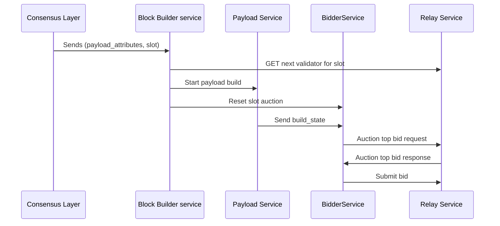

# reth-builder

An EVM block builder based on reth components.

**License:** Licensed under either of [Apache License, Version 2.0](LICENSE-APACHE) or [MIT license](LICENSE-MIT) at your option.

### Disclaimer

**Use at your own risk.** Maintainers do not take responsibility for production use, block builder operation, or deployment decisions. This codebase has been used in production and has landed blocks on mainnet.

- **Vintage** — July 2024; some dependencies may be outdated.
- **Limitations** — Block-building does not resolve transaction conflicts; built blocks may contain reverting transactions.
- **Purpose** — Educational only; reference for architecture and clean code.

**ToC**

- [Disclaimer](#disclaimer)
- [General Flow](#general-flow)
- [Crates](#crates)
- [Run](#run)
- [Deployment](#deployment)

## General Flow



## Crates

### Payload

The payload crate contains the logic for payload building and payload bidding.

#### Building

It implements reth PayloadJobGenerator trait with a custom PayloadJob that implements different building strategies.

#### Strategies

- MempoolStrategy: builds random ordering block consisting only of transactions found in the mempool.
- BundleStrategy: builds block with mev bundles ordered by total value at the top of the block followed by random ordered mempool transactions.

#### Bidding

The BidderService ingests the following data streams:

- incoming build states from StreamJob
- relay auction top bids from all other builders

The service is configured with a specific BidSelectionPolicy that is responsible for valuing build states and computing a bid given the current state of the auction. Current policies include:

- NoProfitPolicy - bids full value with no profit for the builder
- LinearSurplusPolicy - bids between current auction best bid and best local block value and subsidy in a linear increasing function based on time in the auction.
- DevnetPolicy - bids full value without accounting for builder bid payment transaction fees

### Relay

This crate wraps all interaction to mev-boost relays and its made by a Client and a Service.

#### Client

Simple wrapper around the [mev boost relay api specs](https://flashbots.github.io/relay-specs/).

#### Service

Endless future that interacts with the relay client via different commands. The commands are exposed by the relay_handle structure.

### Bundles Api

#### eth_sendBundle

This method is used to send a bundle of transactions. It allows specifying a set of transactions to be executed together within a specific block number range and time window.

Parameters:

- txs (array of strings): An array of hex-encoded signed transactions.
- blockNumber (string): Hex-encoded block number for which this bundle is valid.
- minTimestamp (integer, optional): Unix timestamp indicating when this bundle becomes active.
- maxTimestamp (integer, optional): Unix timestamp indicating how long this bundle stays valid.
- revertingTxHashes (array of strings, optional): A list of hashes of possibly reverting transactions.
- replacementUuid (string, optional): UUID that can be used to cancel or replace this bundle.
- refundPercent (integer, optional): Percentage (from 0 to 100) of the ETH reward of the transaction at refundIndex, refundPercent must be set to receive a refund
- refundIndex (integer, optional): Index of transaction in txs to be used for refund calculation, default is last transaction
- refundRecipient (string, optional): Recipient address of refund, default is sender of last transaction

Returns:

- bundleHash (string): A hash representing the submitted bundle.
  Example:

```json
{
  "jsonrpc": "2.0",
  "method": "eth_sendBundle",
  "params": [
    {
      "txs": ["0x..."], // Array of signed transactions
      "blockNumber": "0x1e8480",
      "minTimestamp": 1616585580,
      "maxTimestamp": 1616585680,
      "revertingTxHashes": [],
      "replacementUuid": null,
      "refundPercent": null,
      "refundIndex": null,
      "refundRecipient": null
    }
  ],
  "id": 1
}
```

#### eth_cancelBundle

This method allows users to cancel a previously sent transaction bundle.

Parameters:

bundleHash (string): The hash of the bundle to be canceled.
Returns:

A confirmation message or error message.
Example:

```json
{
  "jsonrpc": "2.0",
  "method": "eth_cancelBundle",
  "params": ["0x..."], // Bundle hash
  "id": 1
}
```

#### eth_sendPrivateTransaction

This method is used for sending private transactions, which are not immediately disclosed on the Ethereum network.

Parameters:

privateTransaction (string): Hex-encoded transaction data.
Returns:

transactionHash (string): The hash of the submitted private transaction.
Example:

```json
{
  "jsonrpc": "2.0",
  "method": "eth_sendPrivateTransaction",
  "params": ["0x..."], // Hex-encoded private transaction
  "id": 1
}
```

## Build requirements

- **macOS (aarch64 / Apple Silicon):** Install system libffi so the build uses it instead of compiling the bundled one (avoids CFI assembly errors with Xcode 16+): `brew install libffi`
- **First build:** Run `cargo update -p time` once (fixes a `time` crate compile error on Rust 1.80+).

## Devnet

To run the devnet you need to have docker and docker-compose installed.

You can start it by running:

```bash
  ./devnet/start.sh
```

This will spin up a pbs devnet:

- Reth builder as execution layer
- Prysm standard image as consensus layer
- Prysm standard image as validator
- Mev Boost Relay (Redis, Postgres, Memcached)
- Mev Boost
- Reth Payload Validator

# Tests

## Unit tests

Run the full test suite (same as CI):

```bash
cargo test --all
```
