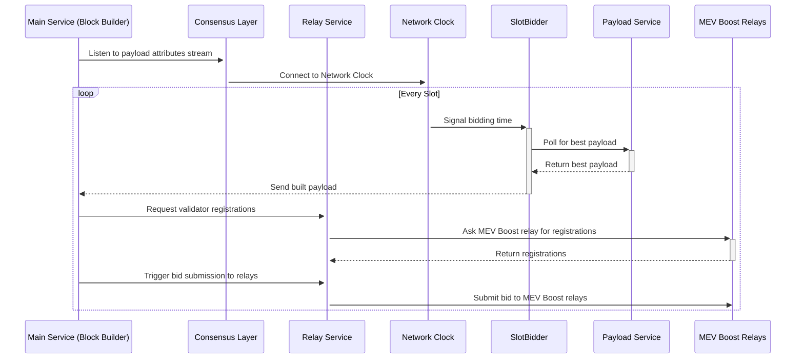

```mermaid
    sequenceDiagram
        participant MS as Main Service (Block Builder)
        participant CL as Consensus Layer
        participant RS as Relay Service
        participant NC as Network Clock
        participant SB as SlotBidder
        participant PS as Payload Service
        participant MEV as MEV Boost Relays

        MS->>+CL: Listen to payload attributes stream
        CL->>+NC: Connect to Network Clock
        loop Every Slot
            NC->>+SB: Signal bidding time
            SB->>+PS: Poll for best payload
            PS-->>-SB: Return best payload
            SB-->>-MS: Send built payload
            MS->>+RS: Request validator registrations
            RS->>+MEV: Ask MEV Boost relay for registrations
            MEV-->>-RS: Return registrations
            MS->>RS: Trigger bid submission to relays
            RS->>MEV: Submit bid to MEV Boost relays
        end
```
