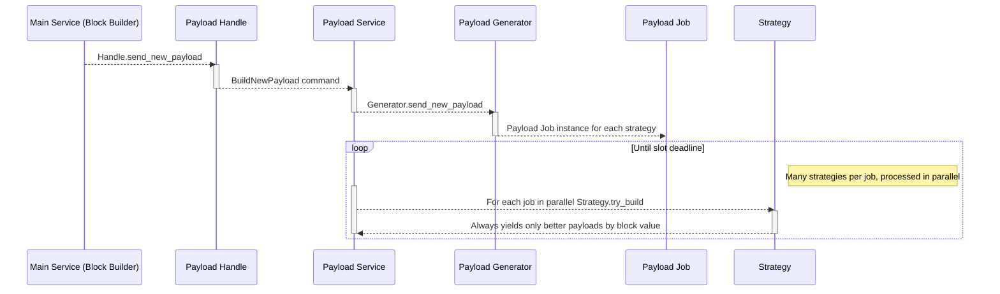

```mermaid
sequenceDiagram
    participant MS as Main Service (Block Builder)
    participant PH as Payload Handle
    participant PS as Payload Service
    participant PG as Payload Generator
    participant PJ as Payload Job
    participant S as Strategy

    MS-->>PH: Handle.send_new_payload
    activate PH
    PH-->>PS: BuildNewPayload command
    deactivate PH
    activate PS
    PS-->>PG: Generator.send_new_payload
    deactivate PS
    activate PG
    PG-->>PJ: Payload Job instance for each strategy
    deactivate PG
    loop Until slot deadline
        Note right of S: Many strategies per job, processed in parallel
        activate PS
        PS -->> S: For each job in parallel Strategy.try_build
        activate S
        S -->>PS: Always yields only better payloads by block value
        deactivate S
        deactivate PS
    end


```
