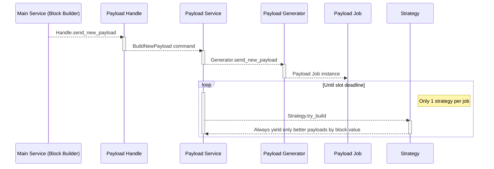

```mermaid
    sequenceDiagram
        participant MS as Main Service (Block Builder)
        participant PH as Payload Handle
        participant PS as Payload Service
        participant PG as Payload Generator
        participant PJ as Payload Job
        participant S as Strategy

        MS-->>PH: Handle.send_new_payload
        activate PH
        PH-->>PS: BuildNewPayload command
        deactivate PH
        activate PS
        PS-->>PG: Generator.send_new_payload
        deactivate PS
        activate PG
        PG-->>PJ: Payload Job instance
        deactivate PG
        loop Until slot deadline
            activate PS
            Note right of S: Only 1 strategy per job
            PS-->>S: Strategy.try_build
            activate S
            S -->>PS: Always yield only better payloads by block value
            deactivate S
            deactivate PS
        end
```
